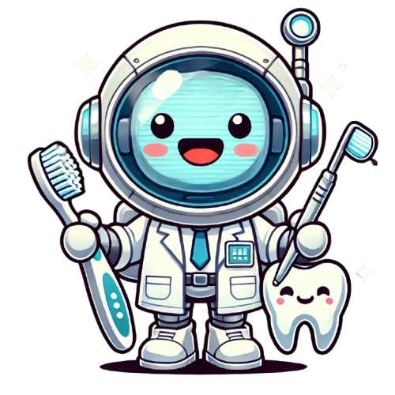

# **OdontoBot** 🦷

[](https://reactjs.org/)
[](https://openai.com/)
[](LICENSE)

## **Visão Geral**

OdontoBot é um assistente virtual baseado em inteligência artificial desenvolvido para estudantes e profissionais da odontologia. O projeto utiliza a API da OpenAI para fornecer respostas detalhadas sobre diversos tópicos odontológicos, facilitando o estudo, pesquisa e esclarecimento de dúvidas técnicas.

<p align="center">
  
</p>

## **Principais Funcionalidades**

- **Consulta Especializada:** Utilize inteligência artificial para obter respostas sobre tópicos odontológicos
- **Exportação para PDF:** Salve as respostas em formato PDF para estudo posterior
- **Interface Intuitiva:** Design responsivo e amigável com exibição organizada das respostas
- **Conteúdo Educacional:** Explicações detalhadas sobre diagnósticos, tratamentos, prevenção e reabilitação oral

## **Público-Alvo**

- Estudantes de graduação e pós-graduação em odontologia
- Professores e pesquisadores da área odontológica
- Clínicos e especialistas buscando informações atualizadas
- Entusiastas interessados em saúde bucal

## **Demonstração**

[Link para demonstração ao vivo](https://odontobot.vercel.app) (Em breve)

## **Tecnologias Utilizadas**

- React 18
- Bootstrap 5
- OpenAI API (GPT-3.5 Turbo)
- jsPDF (para exportação de documentos)
- React Toastify (notificações)

## **Estrutura do Projeto**

```
odontobot/
├── public/               # Arquivos públicos estáticos
├── src/                  # Código fonte da aplicação
│   ├── assets/           # Recursos estáticos (imagens, estilos)
│   │   ├── images/       # Imagens e ícones
│   │   └── styles/       # Arquivos CSS/SCSS
│   ├── components/       # Componentes React reutilizáveis
│   │   ├── common/       # Componentes compartilhados (UI)
│   │   ├── features/     # Componentes específicos de funcionalidades
│   │   └── layout/       # Componentes de estrutura (Navbar, Footer)
│   ├── hooks/            # Custom hooks React
│   ├── services/         # Serviços de API e integrações
│   ├── utils/            # Funções utilitárias
│   ├── context/          # Contextos React (estado global)
│   ├── App.js            # Componente principal
│   └── index.js          # Ponto de entrada
├── .env                  # Variáveis de ambiente (não incluir no git)
├── .gitignore            # Arquivos ignorados pelo git
├── package.json          # Dependências e scripts
└── README.md             # Documentação
```

## **Instalação e Configuração**

### Pré-requisitos

- Node.js (v14 ou superior)
- npm ou yarn

### Instalação

1. Clone o repositório:

   ```sh
   git clone https://github.com/mapsegundo/odontobot.git
   cd odontobot
   ```

2. Instale as dependências:

   ```sh
   npm install
   # ou
   yarn install
   ```

3. Configure as variáveis de ambiente:

   - Crie um arquivo `.env` na raiz do projeto baseado no `.env.example`
   - Adicione sua chave de API da OpenAI:
     ```
     REACT_APP_OPENAI_API_KEY=sua_chave_api_aqui
     ```

4. Inicie o servidor de desenvolvimento:

   ```sh
   npm start
   # ou
   yarn start
   ```

5. Acesse [http://localhost:3000](http://localhost:3000) no navegador

## **Uso**

1. Digite sua dúvida odontológica no campo de texto
2. Clique em "Enviar" para receber a resposta
3. A resposta será exibida em formato HTML estruturado
4. Utilize o botão de download para salvar a resposta em PDF

## **Segurança**

**Importante:** Nunca compartilhe sua chave da API OpenAI no código ou inclua o arquivo `.env` nos commits. Este arquivo está incluído no `.gitignore` para garantir que não seja enviado ao repositório.

## **Deployment**

Para fazer o deploy da aplicação para produção:

```sh
npm run build
# ou
yarn build
```

Isso criará uma versão otimizada da aplicação na pasta `build/`, que pode ser hospedada em qualquer servidor web estático.

## **Roadmap**

- [ ] Implementar modo escuro
- [ ] Adicionar histórico de consultas
- [ ] Melhorar responsividade mobile
- [ ] Implementar sistema de feedback para respostas
- [ ] Adicionar categorização por tópicos odontológicos
- [ ] Criar biblioteca de imagens de referência
- [ ] Melhorar acessibilidade

## **Contribuição**

Contribuições são bem-vindas! Para contribuir:

1. Faça um fork do projeto
2. Crie uma branch para sua feature: `git checkout -b feature/nova-funcionalidade`
3. Faça commit das mudanças: `git commit -m 'Adiciona nova funcionalidade'`
4. Envie para o repositório remoto: `git push origin feature/nova-funcionalidade`
5. Abra um Pull Request

## **Licença**

Este projeto está licenciado sob a licença MIT - veja o arquivo [LICENSE](LICENSE) para mais detalhes.

## **Contato**

- **Desenvolvedor:** Marshall Paiva
- **Email:** marshallpaiva@hotmail.com
- **GitHub:** [mapsegundo](https://github.com/mapsegundo)

---

<p align="center">
  Feito com ❤️ para a comunidade odontológica
</p>
